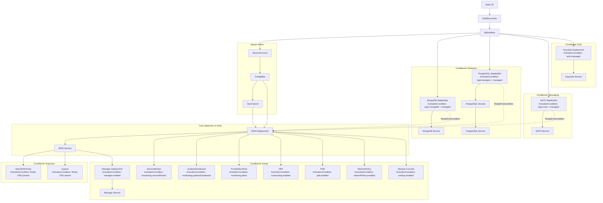
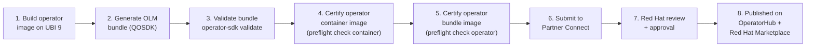

# EDDI Operator v2 — Complete Implementation Plan

> **Repository:** [labsai/EDDI-operator](https://github.com/labsai/eddi-operator) (reuse existing repo, full rewrite — no old code preserved)
>
> **Goal:** A modern, Red Hat-certifiable Kubernetes Operator for EDDI v6, targeting Capability Level 3+ (Full Lifecycle) with a roadmap to Level 5 (Auto Pilot).
>
> **Status:** ✅ Plan approved. To be executed in a future conversation.

---

## 1. Gap Analysis — Old Operator vs. Requirements

### What Exists in `labsai/EDDI-operator` Today

The repo has **79 commits** and contains:

| File/Dir | What It Is |
|---|---|
| `roles/eddioperator/` | Ansible role — the actual operator logic |
| `playbook.yaml` | Ansible playbook entry point |
| `watches.yaml` | Maps CRD to Ansible role |
| `build/` | Dockerfile for the Ansible-based operator image |
| `bundle/` | OLM bundle manifests (CSV, CRD) |
| `deploy/` | K8s deployment manifests for the operator itself |
| `molecule/` | Ansible Molecule tests |
| `licenses/` | License files for Red Hat certification |
| `bundle.7z`, `bundle.zip`, `eddi.zip` | Archived bundles |

**Languages:** 81% Dockerfile, 19% Shell — no Java, no Go, no structured logic.

### Gap Summary

| Dimension | Old (Ansible) | Required (v6) | Gap |
|---|---|---|---|
| **API Version** | `labs.ai/v1alpha1` | `eddi.labs.ai/v1beta1` → `v1` | Complete redesign |
| **CRD Fields** | `size`, `mongodb.{environment, storageclass_name, storage_size}` | 30+ fields across 8 sub-specs | Complete redesign |
| **Backends** | MongoDB only | MongoDB, PostgreSQL (pgvector), external refs | New |
| **Messaging** | None | NATS JetStream (optional) | New |
| **Auth** | None | Keycloak OIDC (optional) | New |
| **Manager UI** | None | Deployable as sub-component | New |
| **Secrets** | None | Vault master key from K8s Secret | New |
| **Monitoring** | None | ServiceMonitor, GrafanaDashboard, PrometheusRule | New |
| **Autoscaling** | None | HPA with CPU/memory targets | New |
| **Backup** | None | CronJob-based DB backup/restore | New |
| **Upgrades** | None | Rolling update, PDB, version migration | New |
| **Ingress/Route** | Route only (OpenShift-specific) | Auto-detect Route vs Ingress | Redesign |
| **Capability Level** | Level 1 | Level 3+ | Major investment |
| **Technology** | Ansible Operator SDK | Java/Quarkus + JOSDK | Complete rewrite |
| **Testing** | Molecule (minimal) | Unit + Integration + E2E | Complete rewrite |
| **CI/CD** | None visible | GitHub Actions → OLM → Red Hat certification | New |

**Verdict:** Wipe the repo contents and rebuild from scratch. The repo identity (`labsai/EDDI-operator`), its GitHub URL, and any Red Hat/Quay.io metadata linkages are the only things worth preserving.

---

## 2. Technology Stack — Verified

All versions verified on the web as of **March 29, 2026**:

| Component | Version | Verified Source |
|---|---|---|
| **JOSDK** | 5.3.2 (released March 2026) | [GitHub Releases](https://github.com/operator-framework/java-operator-sdk/releases) |
| **QOSDK** | 7.7.3 (released March 25, 2026) | [Maven Central](https://mvnrepository.com) |
| **Quarkus** | 3.34.x LTS | Same version track as EDDI main |
| **Fabric8 Client** | 7.x (managed by Quarkus BOM) | Transitive via QOSDK |

### Java Version Decision: 21 (not 25)

> [!IMPORTANT]
> **Use Java 21 for the operator, not Java 25.** Rationale:
> - Red Hat certifies and supports Java 21 as the LTS track for OpenShift.
> - GraalVM native image support is fully stable for Java 21; Java 25 support is newer and may have edge cases with reflection registration.
> - The operator is a separate deployable from EDDI itself — it doesn't need Java 25 features.
> - Operators should be maximally stable and conservative; they run with cluster-level privileges.

### Build & Distribution

| Artifact | Format | Registry |
|---|---|---|
| **Operator Image (JVM)** | `Dockerfile.jvm` → UBI 9 + Java 21 | `quay.io/labsai/eddi-operator:6.0.0` |
| **Operator Image (Native)** | `Dockerfile.native` → UBI 9 minimal + binary | `quay.io/labsai/eddi-operator:6.0.0-native` |
| **OLM Bundle** | OCI image with CSV + CRD + metadata | `quay.io/labsai/eddi-operator-bundle:6.0.0` |
| **FBC Catalog** | File-Based Catalog index image | `quay.io/labsai/eddi-operator-catalog:latest` |

> Ship **both JVM and native images**. JVM is the safe default; native is optional for customers who need minimal footprint (~50MB RSS vs ~200MB).

---

## 3. CRD Design

### API Group & Versioning Strategy

| Field | Value | Rationale |
|---|---|---|
| **Group** | `eddi.labs.ai` | Clearly scoped to EDDI; `labs.ai` alone is too generic |
| **Initial Version** | `v1beta1` | Feature-complete but may evolve; signals "not yet frozen" |
| **Target Stable** | `v1` | After 6 months of production use |
| **Kind** | `Eddi` | Singular, consistent with old operator |

### Full CRD Specification

```yaml
apiVersion: eddi.labs.ai/v1beta1
kind: Eddi
metadata:
  name: my-eddi
  namespace: eddi-production
spec:
  # ── Core Application ──────────────────────────
  version: "6.0.0"                    # Maps to EDDI image tag
  replicas: 2
  image:
    repository: labsai/eddi           # Default image
    tag: ""                           # Empty = use spec.version
    pullPolicy: IfNotPresent
    pullSecrets: []                   # imagePullSecrets references

  # ── Datastore ─────────────────────────────────
  datastore:
    type: mongodb                     # "mongodb" | "postgres"

    # -- Managed Mode: Operator deploys a simple single-node instance
    #    Suitable for: dev, test, demos, small production
    managed:
      enabled: true                   # false = use external
      storage:
        size: 20Gi
        storageClassName: ""          # Empty = cluster default
      resources:
        requests:
          cpu: 250m
          memory: 512Mi
        limits:
          cpu: "1"
          memory: 1Gi

    # -- External Mode: Operator connects EDDI to a pre-existing database
    #    Suitable for: production with CloudNativePG, MongoDB Atlas, etc.
    external:
      connectionString: ""            # Full connection URI
      secretRef: ""                   # K8s Secret with credentials
                                      # Secret keys: "username", "password"
                                      # For Postgres also: "jdbc-url"

  # ── Messaging ─────────────────────────────────
  messaging:
    type: in-memory                   # "in-memory" | "nats"
    managed:
      enabled: true
      storage:
        size: 5Gi
        storageClassName: ""
      resources:
        requests:
          cpu: 50m
          memory: 64Mi
        limits:
          cpu: 500m
          memory: 256Mi
    external:
      url: ""                         # nats://host:4222

  # ── Security & Secrets ────────────────────────
  vault:
    masterKeySecretRef: ""            # K8s Secret name (key: "master-key")
                                      # If empty, operator auto-generates one
  auth:
    enabled: false
    provider: keycloak                # Only "keycloak" for now
    managed:
      enabled: false                  # Deploys a simple Keycloak instance
      adminSecretRef: ""              # Secret with admin user/pass
      resources:
        requests:
          cpu: 250m
          memory: 512Mi
        limits:
          cpu: "1"
          memory: 1Gi
    external:
      authServerUrl: ""               # https://keycloak.example.com/realms/eddi
      clientId: eddi-backend

  # ── Network Exposure ──────────────────────────
  exposure:
    type: auto                        # "auto" | "route" | "ingress" | "none"
                                      # "auto" = Route if OpenShift, Ingress if K8s
    host: ""                          # Required for ingress; optional for route
    tls:
      enabled: true
      secretRef: ""                   # TLS secret; empty = platform default
    annotations: {}                   # Extra annotations on Ingress/Route
    ingressClassName: ""              # e.g., "nginx", "traefik"

  # ── Manager UI ────────────────────────────────
  manager:
    enabled: true
    image:
      repository: labsai/eddi-config-ui
      tag: latest
    resources:
      requests:
        cpu: 50m
        memory: 64Mi
      limits:
        cpu: 250m
        memory: 256Mi

  # ── Observability ─────────────────────────────
  monitoring:
    serviceMonitor:
      enabled: false                  # Requires Prometheus Operator
      interval: 30s
      labels: {}                      # Extra labels for ServiceMonitor discovery
    grafanaDashboard:
      enabled: false                  # Requires Grafana Operator
    alerts:
      enabled: false                  # Creates PrometheusRule with default alerts

  # ── Autoscaling ───────────────────────────────
  autoscaling:
    enabled: false
    minReplicas: 2
    maxReplicas: 10
    targetCPU: 70                     # Percent
    targetMemory: 80                  # Percent

  # ── Pod Disruption ────────────────────────────
  podDisruptionBudget:
    enabled: false
    minAvailable: 1

  # ── Resources ─────────────────────────────────
  resources:
    requests:
      cpu: 250m
      memory: 384Mi
    limits:
      cpu: "2"
      memory: 1Gi

  # ── Backup & Restore (Phase 3) ────────────────
  backup:
    enabled: false
    schedule: "0 2 * * *"             # Daily at 02:00
    retentionDays: 7
    storage:
      type: pvc                       # "pvc" | "s3"
      pvc:
        size: 50Gi
        storageClassName: ""
      s3:
        bucket: ""
        region: ""
        endpoint: ""                  # For S3-compatible (MinIO)
        secretRef: ""                 # Secret with access-key/secret-key

  # ── CORS ──────────────────────────────────────
  cors:
    origins: "http://localhost:3000,http://localhost:7070"

  # ── Network Policy ────────────────────────────
  networkPolicy:
    enabled: false

status:
  observedGeneration: 0
  phase: ""                           # Pending | Deploying | Running | Failed | Upgrading
  version: ""                         # Currently running version
  replicas: 0
  readyReplicas: 0
  url: ""                             # Resolved external URL
  conditions:
    - type: Available                 # Overall system availability
      status: "Unknown"
      reason: ""
      message: ""
      lastTransitionTime: ""
    - type: DatastoreReady           # DB is connected and healthy
      status: "Unknown"
    - type: MessagingReady           # NATS is connected (if configured)
      status: "Unknown"
    - type: Progressing              # Deployment is rolling out
      status: "Unknown"
    - type: Degraded                 # Something is wrong but system is up
      status: "Unknown"
```

### Design Decisions on the CRD

| Decision | Rationale |
|---|---|
| **`managed` + `external` pattern** | Allows the same CRD to handle both "deploy everything for me" (dev/demo) and "I have my own HA database" (production). No separate CRDs needed. |
| **`exposure.type: auto`** | Uses JOSDK's `CRDPresentActivationCondition` to detect OpenShift (Route CRD exists) vs vanilla K8s (use Ingress). Zero config required. |
| **Vault auto-generation** | If `vault.masterKeySecretRef` is empty, the operator generates a random 256-bit key and stores it in a Secret. Avoids the "forgot to create the secret" failure mode. |
| **`v1beta1` not `v1alpha1`** | The CRD is feature-complete and production-usable. `v1alpha1` signals "might break" — we want users to trust it. `v1beta1` allows evolution without the "frozen forever" promise of `v1`. |
| **Conditions array** | Follows Kubernetes conventions. Each condition is independently observable. `phase` is for human readability; `conditions` are for programmatic use. |

---

## 4. Reconciler Architecture

### Dependent Resource Workflow



### Key JOSDK 5.3.x Patterns Used

| Pattern | How We Use It |
|---|---|
| **`@Workflow` + `@Dependent`** | Declarative workflow on `EddiReconciler` listing all 20+ dependent resources |
| **`ActivationCondition`** | Each optional component has a condition. E.g., `MongoActivationCondition` checks `spec.datastore.type == "mongodb" && spec.datastore.managed.enabled == true` |
| **`CRDPresentActivationCondition`** | Route DR uses this to auto-detect OpenShift vs K8s. Also used for ServiceMonitor (requires Prometheus Operator) and GrafanaDashboard (requires Grafana Operator) |
| **`ReadyPostcondition`** | Database DRs have a ready check (pod in `Running` state). EDDI Deployment only reconciles after database is ready. |
| **`dependsOn`** | EDDI Deployment depends on ConfigMap, VaultSecret, and database DRs. Route/Ingress depends on Service. |
| **`CRUDKubernetesDependentResource`** | Base class for all DRs. Implements `desired()` to compute the target state. JOSDK handles create/update/delete via Server-Side Apply. |
| **Owner References** | All child resources get owner reference to the Eddi CR → garbage collection on CR deletion |
| **Finalizers** | On CR deletion: (1) run final backup if `backup.enabled`, (2) clean up PVCs if configured, (3) remove finalizer |

### Dual Database Strategy in Detail

```
┌─────────────────────────────────────────────────────────────────┐
│                     spec.datastore.type                         │
├──────────────────────────┬──────────────────────────────────────┤
│        mongodb           │            postgres                  │
├──────────────────────────┼──────────────────────────────────────┤
│                          │                                      │
│  managed.enabled=true?   │  managed.enabled=true?               │
│  ┌─YES──────────────┐   │  ┌─YES──────────────┐               │
│  │ Deploy:           │   │  │ Deploy:           │               │
│  │ • StatefulSet     │   │  │ • StatefulSet     │               │
│  │   (mongo:7.0)     │   │  │   (postgres:16)   │               │
│  │ • Service         │   │  │ • Service         │               │
│  │ • PVC (storage)   │   │  │ • PVC (storage)   │               │
│  │                   │   │  │ • Secret (creds)  │               │
│  │ ConfigMap sets:   │   │  │                   │               │
│  │ MONGODB_CONN...   │   │  │ ConfigMap sets:   │               │
│  │ EDDI_DATASTORE=   │   │  │ QUARKUS_PROFILE=  │               │
│  │   mongodb         │   │  │   postgres        │               │
│  └───────────────────┘   │  │ QUARKUS_DS_URL=   │               │
│                          │  │   jdbc:...         │               │
│  managed.enabled=false?  │  └───────────────────┘               │
│  ┌─NO (external)────┐   │                                      │
│  │ No StatefulSet    │   │  managed.enabled=false?               │
│  │                   │   │  ┌─NO (external)────┐               │
│  │ ConfigMap sets:   │   │  │ No StatefulSet    │               │
│  │ MONGODB_CONN=     │   │  │                   │               │
│  │  external.conn..  │   │  │ ConfigMap reads:  │               │
│  │                   │   │  │ external.secretRef│               │
│  │ If secretRef:     │   │  │ → mount jdbc-url  │               │
│  │ mount as env      │   │  └───────────────────┘               │
│  └───────────────────┘   │                                      │
└──────────────────────────┴──────────────────────────────────────┘
```

> For production, customers should use dedicated operators: **CloudNativePG** (Postgres), **MongoDB Community Operator**, **NATS Operator**. The EDDI operator then just connects to them via `external.connectionString` / `external.secretRef`.

---

## 5. Project Structure

```
EDDI-operator/                        # Existing repo, contents replaced
├── .github/
│   └── workflows/
│       ├── ci.yml                    # Build + test + validate bundle
│       ├── release.yml               # Tag → build images → push → certify
│       └── preflight.yml             # PR-level preflight dry-run
├── src/
│   └── main/
│       ├── java/ai/labs/eddi/operator/
│       │   ├── crd/
│       │   │   ├── EddiResource.java           # @Group("eddi.labs.ai") @Version("v1beta1")
│       │   │   ├── EddiSpec.java               # Top-level spec record
│       │   │   ├── EddiStatus.java             # Status with conditions
│       │   │   └── spec/
│       │   │       ├── DatastoreSpec.java       # type, managed, external
│       │   │       ├── ManagedDatabaseSpec.java # storage, resources
│       │   │       ├── ExternalDatabaseSpec.java
│       │   │       ├── MessagingSpec.java
│       │   │       ├── AuthSpec.java
│       │   │       ├── ExposureSpec.java
│       │   │       ├── ManagerSpec.java
│       │   │       ├── MonitoringSpec.java
│       │   │       ├── AutoscalingSpec.java
│       │   │       ├── BackupSpec.java
│       │   │       ├── VaultSpec.java
│       │   │       ├── ImageSpec.java
│       │   │       ├── ResourcesSpec.java
│       │   │       └── PdbSpec.java
│       │   ├── reconciler/
│       │   │   ├── EddiReconciler.java          # @Workflow with all @Dependent
│       │   │   └── StatusUpdater.java           # Computes status from child resources
│       │   ├── dependent/
│       │   │   ├── core/
│       │   │   │   ├── ServiceAccountDR.java
│       │   │   │   ├── ConfigMapDR.java         # EDDI application config
│       │   │   │   ├── VaultSecretDR.java       # Vault master key
│       │   │   │   ├── EddiDeploymentDR.java    # EDDI server Deployment
│       │   │   │   └── EddiServiceDR.java       # EDDI ClusterIP Service
│       │   │   ├── datastore/
│       │   │   │   ├── MongoStatefulSetDR.java
│       │   │   │   ├── MongoServiceDR.java
│       │   │   │   ├── PostgresStatefulSetDR.java
│       │   │   │   ├── PostgresServiceDR.java
│       │   │   │   └── PostgresSecretDR.java
│       │   │   ├── messaging/
│       │   │   │   ├── NatsStatefulSetDR.java
│       │   │   │   └── NatsServiceDR.java
│       │   │   ├── auth/
│       │   │   │   ├── KeycloakDeploymentDR.java
│       │   │   │   └── KeycloakServiceDR.java
│       │   │   ├── exposure/
│       │   │   │   ├── RouteDR.java              # OpenShift Route
│       │   │   │   └── IngressDR.java            # Standard K8s Ingress
│       │   │   ├── extras/
│       │   │   │   ├── ManagerDeploymentDR.java
│       │   │   │   ├── ManagerServiceDR.java
│       │   │   │   ├── HpaDR.java
│       │   │   │   ├── PdbDR.java
│       │   │   │   └── NetworkPolicyDR.java
│       │   │   └── monitoring/
│       │   │       ├── ServiceMonitorDR.java
│       │   │       ├── GrafanaDashboardDR.java
│       │   │       └── PrometheusRuleDR.java
│       │   ├── conditions/
│       │   │   ├── MongoActivationCondition.java
│       │   │   ├── PostgresActivationCondition.java
│       │   │   ├── NatsActivationCondition.java
│       │   │   ├── ManagedAuthActivationCondition.java
│       │   │   ├── ManagerActivationCondition.java
│       │   │   ├── RouteActivationCondition.java  # extends CRDPresentActivationCondition
│       │   │   ├── IngressActivationCondition.java # inverse of Route
│       │   │   ├── MonitoringActivationCondition.java
│       │   │   ├── BackupActivationCondition.java
│       │   │   ├── DatabaseReadyCondition.java    # ReadyPostcondition
│       │   │   └── NatsReadyCondition.java
│       │   └── util/
│       │       ├── Labels.java                    # Standard labels builder
│       │       ├── Hashing.java                   # ConfigMap/Secret hash for rollouts
│       │       └── Defaults.java                  # Sensible defaults for unset fields
│       └── resources/
│           ├── application.properties             # Operator config
│           └── dashboards/
│               └── eddi-overview.json             # Grafana dashboard JSON
│   └── test/
│       └── java/ai/labs/eddi/operator/
│           ├── unit/
│           │   ├── ConfigMapDRTest.java           # Verify desired() output
│           │   ├── EddiDeploymentDRTest.java
│           │   └── ConditionTests.java
│           ├── integration/
│           │   └── EddiReconcilerIT.java          # MockKubernetesServer
│           └── e2e/
│               └── EddiOperatorE2ETest.java       # Testcontainers + K3s
├── Dockerfile.jvm                    # UBI 9 + Java 21, Red Hat cert labels
├── Dockerfile.native                 # UBI 9 minimal + GraalVM native binary
├── Makefile                          # build, test, bundle, push, certify
├── pom.xml
├── AGENTS.md                         # AI assistant instructions for operator repo
├── README.md
├── LICENSE                           # Apache 2.0
└── docs/
    └── user-guide.md                 # End-user documentation
```

---

## 6. Key Dependencies (pom.xml)

```xml
<properties>
    <quarkus.platform.version>3.34.1</quarkus.platform.version>
    <java.version>21</java.version>
</properties>

<!-- Quarkus BOM -->
<dependencyManagement>
    <dependencies>
        <dependency>
            <groupId>io.quarkus.platform</groupId>
            <artifactId>quarkus-bom</artifactId>
            <version>${quarkus.platform.version}</version>
            <type>pom</type>
            <scope>import</scope>
        </dependency>
    </dependencies>
</dependencyManagement>

<dependencies>
    <!-- Operator SDK (includes JOSDK 5.3.x) -->
    <dependency>
        <groupId>io.quarkiverse.operatorsdk</groupId>
        <artifactId>quarkus-operator-sdk</artifactId>
    </dependency>

    <!-- OLM Bundle Generator -->
    <dependency>
        <groupId>io.quarkiverse.operatorsdk</groupId>
        <artifactId>quarkus-operator-sdk-bundle-generator</artifactId>
    </dependency>

    <!-- OpenShift client (for Route support) -->
    <dependency>
        <groupId>io.quarkus</groupId>
        <artifactId>quarkus-openshift-client</artifactId>
    </dependency>

    <!-- Health checks -->
    <dependency>
        <groupId>io.quarkus</groupId>
        <artifactId>quarkus-smallrye-health</artifactId>
    </dependency>

    <!-- Metrics -->
    <dependency>
        <groupId>io.quarkus</groupId>
        <artifactId>quarkus-micrometer-registry-prometheus</artifactId>
    </dependency>

    <!-- Container image build (Jib) -->
    <dependency>
        <groupId>io.quarkus</groupId>
        <artifactId>quarkus-container-image-jib</artifactId>
    </dependency>

    <!-- Testing -->
    <dependency>
        <groupId>io.quarkus</groupId>
        <artifactId>quarkus-junit5</artifactId>
        <scope>test</scope>
    </dependency>
    <dependency>
        <groupId>io.quarkus</groupId>
        <artifactId>quarkus-test-kubernetes-client</artifactId>
        <scope>test</scope>
    </dependency>
</dependencies>
```

---

## 7. Capability Level Roadmap

### Phase 1 — Level 1: Basic Install (MVP)

**Scope:** One `kubectl apply` deploys the entire EDDI stack.

| # | Task | Complexity |
|---|---|---|
| 1.1 | Scaffold Quarkus project with QOSDK extension | S |
| 1.2 | Define CRD POJOs (`EddiResource`, `EddiSpec`, `EddiStatus`, all sub-specs) | M |
| 1.3 | Implement `ConfigMapDR` — generates EDDI environment config from CR spec | M |
| 1.4 | Implement `VaultSecretDR` — creates or references vault master key | S |
| 1.5 | Implement `ServiceAccountDR` | S |
| 1.6 | Implement `MongoStatefulSetDR` + `MongoServiceDR` with activation condition | M |
| 1.7 | Implement `PostgresStatefulSetDR` + `PostgresServiceDR` + `PostgresSecretDR` | M |
| 1.8 | Implement `NatsStatefulSetDR` + `NatsServiceDR` with activation condition | M |
| 1.9 | Implement `EddiDeploymentDR` — the core EDDI server Deployment | L |
| 1.10 | Implement `EddiServiceDR` | S |
| 1.11 | Implement `RouteDR` with `CRDPresentActivationCondition` | M |
| 1.12 | Implement `IngressDR` with inverse activation condition | M |
| 1.13 | Implement `ManagerDeploymentDR` + `ManagerServiceDR` | S |
| 1.14 | Implement `EddiReconciler` — wire all DRs via `@Workflow` | L |
| 1.15 | Implement `StatusUpdater` — compute phase + conditions from child states | M |
| 1.16 | Implement all `ActivationCondition`s and `ReadyPostcondition`s | M |
| 1.17 | Unit tests for all DRs (verify `desired()` output) | M |
| 1.18 | Integration test with `MockKubernetesServer` | L |
| 1.19 | `Dockerfile.jvm` with UBI 9 base + Red Hat cert labels | S |
| 1.20 | `Dockerfile.native` with Mandrel builder | M |
| 1.21 | OLM bundle generation (CSV, CRD) via QOSDK plugin | M |
| 1.22 | `operator-sdk bundle validate` passes | S |
| 1.23 | GitHub Actions CI workflow | M |
| 1.24 | README + user guide | M |

**Estimated effort:** 3–4 weeks

---

### Phase 2 — Level 2: Seamless Upgrades

**Scope:** Change `spec.version` and the operator does a zero-downtime rolling upgrade.

| # | Task |
|---|---|
| 2.1 | ConfigMap/Secret hash annotation on EDDI Deployment — forces rollout on config change |
| 2.2 | `PdbDR` — Pod Disruption Budget management |
| 2.3 | Pre-upgrade readiness gate — don't proceed if unhealthy |
| 2.4 | Version change detection in reconciler — set `status.phase = Upgrading` |
| 2.5 | Rolling strategy tuning (maxSurge, maxUnavailable from CR spec) |
| 2.6 | CRD conversion webhook scaffold (for future v1beta1 → v1 migration) |
| 2.7 | Upgrade integration tests |

**Estimated effort:** 1–2 weeks

---

### Phase 3 — Level 3: Full Lifecycle

**Scope:** Backup, restore, and clean teardown.

| # | Task |
|---|---|
| 3.1 | `BackupCronJobDR` — CronJob running `mongodump` or `pg_dump` |
| 3.2 | PVC backup storage — mount and write to a dedicated PVC |
| 3.3 | S3 backup storage — write to S3-compatible (AWS, MinIO) |
| 3.4 | Retention enforcement — delete backups older than `retentionDays` |
| 3.5 | Restore trigger — annotation `eddi.labs.ai/restore-from: <backup-name>` |
| 3.6 | Restore Job — runs `mongorestore` or `pg_restore` |
| 3.7 | Finalizer — on CR deletion: run final backup, clean PVCs, remove resources |
| 3.8 | VolumeSnapshot integration (if CSI driver supports it) |
| 3.9 | Backup status reporting in `EddiStatus` |
| 3.10 | Backup/restore integration tests |

**Estimated effort:** 2–3 weeks

---

### Phase 4 — Level 4: Deep Insights

**Scope:** Full observability out of the box.

| # | Task |
|---|---|
| 4.1 | `ServiceMonitorDR` — points to EDDI's `/q/metrics` endpoint |
| 4.2 | `GrafanaDashboardDR` — embeds the EDDI Operations Command Center JSON |
| 4.3 | `PrometheusRuleDR` — default alerting rules (pod down, high error rate, DB connection failure, backup failure, high latency) |
| 4.4 | Operator-level Micrometer metrics (reconciliation count, duration, errors, queue depth) |
| 4.5 | Status enrichment with last-seen metrics |
| 4.6 | Dashboard JSON maintenance workflow |

**Estimated effort:** 1–2 weeks

---

### Phase 5 — Level 5: Auto Pilot

**Scope:** Self-managing, self-healing, self-tuning.

| # | Task |
|---|---|
| 5.1 | HPA auto-configuration based on conversation throughput metrics |
| 5.2 | Auto-healing: detect and restart unhealthy managed components |
| 5.3 | Connection pool auto-tuning based on active conversations |
| 5.4 | Cost-aware scaling — scale down during low traffic windows |
| 5.5 | Anomaly detection integration (Prometheus → operator webhook) |
| 5.6 | Auto-scaling integration tests |

**Estimated effort:** 3–4 weeks (and ongoing refinement)

---

## 8. Red Hat Certification Path

### Prerequisites (Already Done ✅)

| Requirement | Status |
|---|---|
| Red Hat Partner Connect account | ✅ Active |
| EDDI container image certified | ✅ Via `redhat-certify.yml` workflow |
| UBI 9 base image | ✅ `registry.access.redhat.com/ubi9/openjdk-21-runtime` |
| Non-root execution (user 185) | ✅ |
| License files in `/licenses` | ✅ Via `license-maven-plugin` |

### Operator Certification Steps



> [!WARNING]
> **Critical sequencing:** The operator **container image** must be independently certified before the **operator bundle** can be certified. This is a two-step certification, not one.

### OLM Channel Strategy

| Channel | Purpose | Upgrade Policy |
|---|---|---|
| `alpha` | Development builds, breaking changes expected | Manual approval |
| `fast` | Release candidates, tested | Automatic |
| `stable` | Production releases only | Automatic |

### File-Based Catalog

OLM is migrating to **File-Based Catalogs (FBC)** from the old SQLite index format. We'll use `opm` to build FBC-based catalog images:

```bash
# Render bundle into FBC entry
opm render quay.io/labsai/eddi-operator-bundle:6.0.0 -o yaml >> catalog/eddi-operator/catalog.yaml

# Add channel entry
cat >> catalog/eddi-operator/catalog.yaml << EOF
---
schema: olm.channel
package: eddi-operator
name: stable
entries:
  - name: eddi-operator.v6.0.0
EOF

# Validate
opm validate catalog/

# Build catalog image
docker build -f catalog.Dockerfile -t quay.io/labsai/eddi-operator-catalog:latest .
```

---

## 9. CI/CD — GitHub Actions

### Workflow: `ci.yml` (every PR)

```
1. Checkout
2. Setup Java 21
3. mvn compile (fast feedback)
4. mvn test (unit + integration with MockKubernetesServer)
5. mvn package -Pnative (native image build — validates AOT compatibility)
6. Build operator image (JVM)
7. Generate OLM bundle
8. operator-sdk bundle validate
9. Preflight dry-run (no submit)
```

### Workflow: `release.yml` (on tag)

```
1. Build + test (same as CI)
2. Build JVM image → push to quay.io
3. Build native image → push to quay.io
4. Generate + push OLM bundle image
5. Build + push FBC catalog image
6. Preflight check container → submit to Partner Connect
7. Preflight check operator → submit to Partner Connect
8. Create GitHub Release with changelog
```

---

## 10. Testing Strategy

### Three Tiers

| Tier | Tool | What It Tests | Speed |
|---|---|---|---|
| **Unit** | JUnit 5 + Mockito | `desired()` output of each DR, condition logic, status computation | Seconds |
| **Integration** | `@QuarkusTest` + `MockKubernetesServer` | Full reconciliation loop with mocked K8s API | Seconds |
| **E2E** | Testcontainers + K3s | Real cluster: create CR → verify all resources created → upgrade → delete → verify cleanup | Minutes |

### What Each Tier Covers

**Unit tests:**
- Given an `EddiSpec` with MongoDB enabled → `MongoStatefulSetDR.desired()` produces correct StatefulSet YAML
- Given `spec.exposure.type: auto` on OpenShift → Route DR activates, Ingress DR deactivates
- Given empty `vault.masterKeySecretRef` → VaultSecretDR generates a random key

**Integration tests:**
- Create `Eddi` CR → reconciler triggers → all expected K8s API calls made
- Update `spec.replicas: 3` → Deployment patched with 3 replicas
- Delete CR → all child resources deleted (owner reference garbage collection)

**E2E tests:**
- Full stack deployment on K3s in Testcontainers
- Verify EDDI pod comes up and `/q/health/ready` returns 200
- Verify Route/Ingress created with correct host

---

## 11. Migration from Old Operator

For existing users on the Ansible-based operator:

1. **Document breaking change** — new API group (`eddi.labs.ai` vs `labs.ai`), new CRD structure
2. **Provide migration guide** — map old CR fields to new:
   ```yaml
   # OLD
   apiVersion: labs.ai/v1alpha1
   spec:
     size: 1
     mongodb:
       environment: prod
       storageclass_name: managed-nfs-storage
       storage_size: 20G

   # NEW
   apiVersion: eddi.labs.ai/v1beta1
   spec:
     replicas: 1
     datastore:
       type: mongodb
       managed:
         enabled: true
         storage:
           size: 20Gi
           storageClassName: managed-nfs-storage
   ```
3. **No automatic migration** — the old CRD is in a different API group, so both can coexist temporarily
4. **Deprecation timeline** — old operator deprecated immediately, removed from OperatorHub after 6 months

---

## Confirmed Decisions

| # | Decision | Resolution |
|---|---|---|
| 1 | **API Group** | `eddi.labs.ai` — scoped to EDDI, avoids generic `labs.ai` collision. Old `labs.ai/v1alpha1` CRDs are in a different group; no migration needed. |
| 2 | **Java Version** | **Java 21** for the operator. Conservative LTS track, fully stable GraalVM native support. EDDI server stays on Java 25. |
| 3 | **Repo Cleanup** | **Full rewrite, no old code.** Wipe all Ansible content (playbook.yaml, watches.yaml, roles/, molecule/, bundle/). Clean `main` branch. No legacy branch preservation. |

---

## Open Questions

> [!WARNING]
> **1. OLM v1 support?** OLM v1 is still "Technology Preview" on OpenShift as of March 2026. It has fundamental architectural differences from OLM v0. Should we target OLM v0 (the stable, widely-deployed version) for now and add OLM v1 support later? **Recommendation: OLM v0 first.**

> [!WARNING]
> **2. Multi-tenancy?** The CRD currently supports one EDDI instance per CR. Should the operator support multiple CRs in the same namespace (e.g., `my-eddi-dev` and `my-eddi-staging`)? **Recommendation: Yes, via unique naming with `metadata.name` prefix on all child resources.** This is already the pattern in the Helm chart.

> [!WARNING]
> **3. Keycloak managed deployment** — deploying Keycloak is complex (realm config, client setup). Should the managed Keycloak just be a "bring up the server" and leave realm config to the user, or should we also provision the EDDI realm/client? **Recommendation: Server only. Realm provisioning is its own project.**

---

## Verification Plan

### Automated (CI)
- `mvn test` — all unit + integration tests pass
- `mvn package -Pnative` — native image builds successfully
- `operator-sdk bundle validate ./target/bundle` — OLM bundle is valid
- `preflight check container` — operator image passes Red Hat certification
- `preflight check operator` — bundle passes Red Hat operator certification

### Manual (Pre-release)
- Deploy to **CodeReady Containers (CRC)** local OpenShift
- Install via OLM CatalogSource
- Create CR with each configuration variant (MongoDB, Postgres, NATS, Keycloak)
- Verify all pods come up and EDDI responds on the Route
- Test upgrade flow (change `spec.version`)
- Test delete flow (all resources cleaned up)
- Run preflight with `--submit` to Partner Connect staging project
